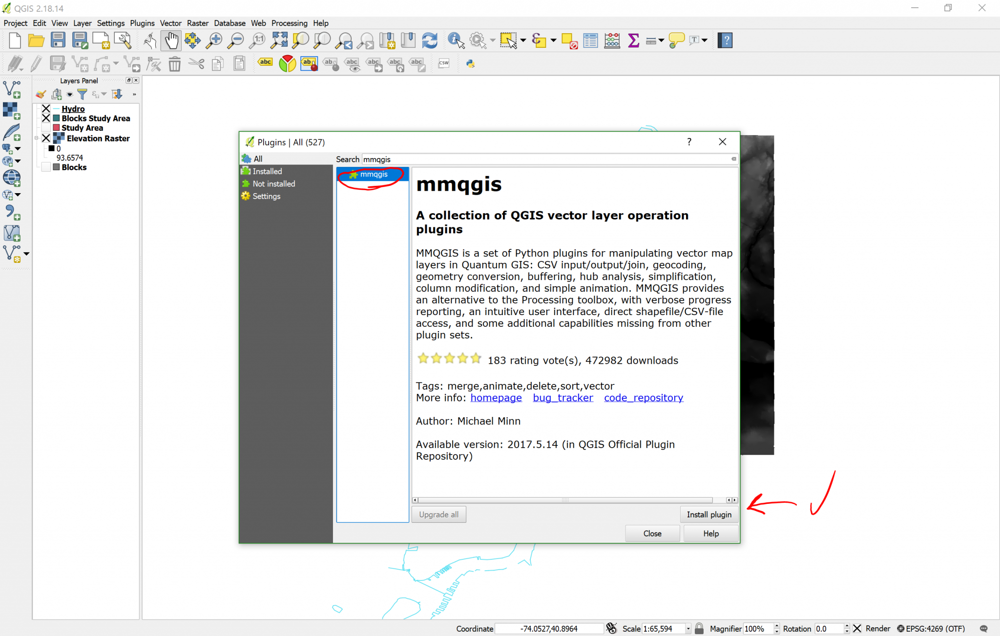
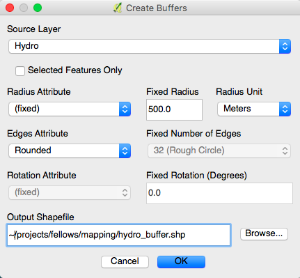

[<<< Previous](10clip.md)  | [Next >>>](12cntour.md)  

# Adding a Plugin & Creating a Buffer Zone

The next step in our task is to calculate the inland areas that will potentially be affected by flood. We will achieve this following two steps: the first step is to create a buffer zone of 500m from the coastlines (defined by the Hydro layer lines), and the second step is to confront that buffer to altitude, to make sure that our map shows areas that would be safe because they are higher than 15m above the sea level. For the first step, we could create a buffer using the “fixed distance buffer” geoprocessing tool (in the same menu we found Clip), however, we won’t do that because the layer is not projected in the project’s CRS and the distances are warped. So we will take this opportunity to introduce one of the awesome things about QGIS: Plugins.

The Open-source nature of QGIS means that many people around the world are constantly developing plugins that improve the capabilities of the software. In this case, we will download a plugin called MMQGIS that offers many practical tools that always interpret distances accurately, regardless of the CRS you’re using. Note that to install plugins you’ll need an Internet connection.

Click on the Plugins menu, and then on “Manage and Install Plugins…”. Wait for the list to load, then write "mmqgis" on the Search bar. Click on MMQGIS on the results and then you can proceed to read the description of the plugin and then click on Install plugin.

Now, you’ll notice that a new menu MMQGIS showed up on your Menu Toolbar. Go ahead and click on it, then on Create, then on Create Buffer.

Here, choose Hydro as the source layer, then select a Fixed Radius of 500 meters. Name the Output Shapefile “hydro_buffer” and place it in a convenient directory in your computer. Leave everything else as is, and click OK. Your result should look something like this:

Notice that in the middle of Manhattan there are some buffers, too. These ones were generated from the lakes in Central Park, but since lakes are not flooding, we can delete them. To delete them, just toggle editing on the Hydro buffer, select those circles in the middle and press the Del key on your keyboard. Now toggle editing off, save the changes on the layer and we can continue.

[<<< Previous](10clip.md)  | [Next >>>](12cntour.md)  
