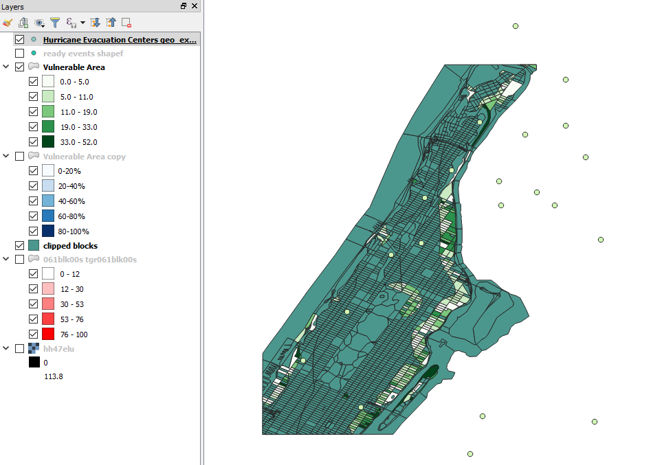
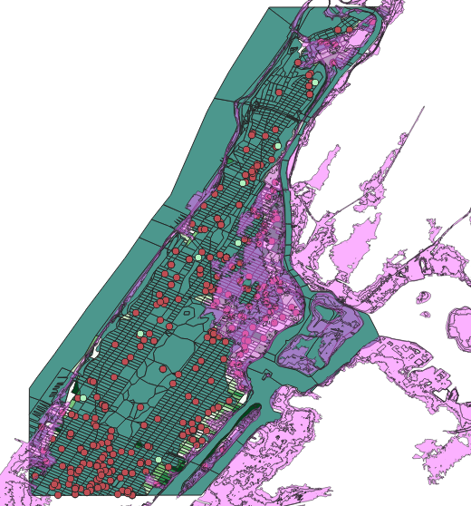

[<<< Previous](17viz.md)  | [Next >>>](19layout.md)  

# Additional Layers and Ideas to Analyze other Aspects

Now that we have visualizations of some of the types of populations within the vulnerable areas, we can add other layers and analyze the relationships between population and the data in these other layers. For this example, we will look at a layer of Hurricane Evacuation Centers in New York City. Are these centers capable of sheltering all of the population in the vulnerable areas?

Opening the Hurricane Evacuation Centers layer, we see the following:

We can remove the points that are outside of the study area by Clipping it with the "Clipped Census Blocks to Study Area" layer (Just like we clipped other layers before). Once you do, rename this new layer "Evacuation Centers in Study Area", and open the Attributes Table. You will notice that there are only eight centers for the whole population. Here are some ideas of types of anaylsis you could do:

- You can divide the total vulnerable population by 8 to know how many people are expected to be sheltered in each of these Evacuation Centers. 
- You could also create a 300-meter buffer to determine whether the centers are at a walkable distance from all the vulnerable population. Take closer attention to neighborhoods with high percentage of people 65 and up, who could have higher chances of difficulties to walk long distances. 
- Note that in the Attributes Table only four of the centers are "Accessible". You could change the visualization of this layer to a Categorized version, where a color represents accessible centers and another color represents non-accessible.

Another interesting layer we can look at is the Ready NY Events. This one is not a mapped layer but a comma-separated-value (CSV) file. Since the file contains latitude and longitude data, it can be mapped into a point layer using QGIS. Once you add the layer, QGIS will automatically identify Longitude for the X axis and Latitude for the Y axis. Be sure to select the correct projection (EPSG:4269). Like the previous layer, you can clip it to the study area to remove data that is irrelevant for this exercise. When opening the Attributes Table, you will notice that there is information on the date of the events, and the names of the events. Events may vary considerably, as some are open to the public (for example, Citizen Preparedness Training), while others seem to be targeted at specific or exclusive audiences (Annual CLIP Teacher Conference, ABC/Disney General Presentation). Some analysis that could be stemmed from this dataset are:

- Apparently the dots are all over the map and they seem to cover all vulnerable population areas. But, does this hold every year? Are there presentations in these areas in the two most recent years?
- If we filter out events that seem to be closed or exclusive, how many events were open to the public?
- If we divide total population by the number of open events, how many events are there per capita?

A final layer that we can overlay with our data is the one of Hurricane Inundation Zones - Worst Case. This is a layer prepared by USGS to determine what areas could potentially be affected in the case of Hurricanes (basically what we did, but with a more complex algorythm). Here are some ideas to use this layer:

- Change its opacity to 50% in the Symbology and lay it over the Vulnerable areas. Does it correspond to the area that we identified? If not, what could be the reason?
- Open the attributes table. You will notice a column called "Category". This refers to the category of hurricanes. If we select categories 1 & 2, we can notice that the selected area resembles the Vulnerable Area of our study, so perhaps our simulated event was in fact equivalent to a Category 2 Hurricane.
- Note that due to the complexity of this layer, operations such as Clipping will take much longer. Since we are only using this layer for comparative purposes, there is no need to clip it to our study area. We can just turn the layer off once we are done comparing.

[<<< Previous](17viz.md)  | [Next >>>](19layout.md)  