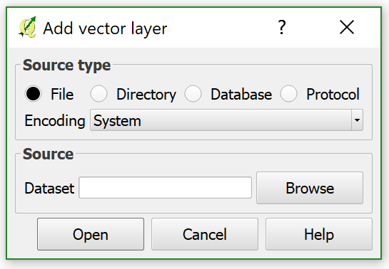
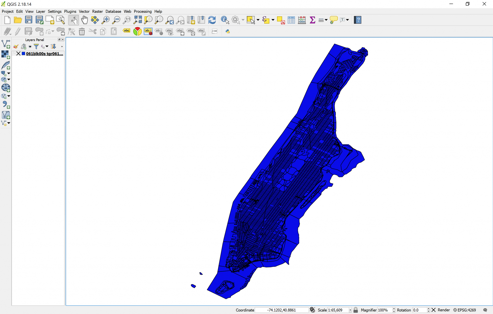

[<<< Previous](setup.md)  | [Next >>>](layerpro.md)  

# Adding a Vector Layer

Once you finish installing QGIS and downloading the required layers, go ahead and open the QGIS Desktop app. After loading, you should see something like this:

On the image above, I highlighted a few areas and buttons related to layers: The `Add Vector Layer` button, the `Add Raster Layer` button, the `Create New Layer` button, and the `Layers` panel. We will not use the Browser Panel so you can go ahead and close this one clicking on the `X` on the top-right corner of the panel.

Whenever you add a layer to your project, it will be shown in the Layers Panel. Let’s go ahead and open the Census Blocks layer by clicking on the Add Vector Layer button. A dialog like this one should open:

Here, click on Browse, go in the BLOCKS folder and select the 061blk00s.zip file directly. When you select it and click on Open, you should get this:

[<<< Previous](setup.md)  | [Next >>>](layerpro.md)  
